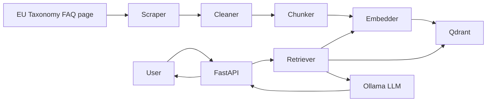

# EU Taxonomy FAQ Assistant

An LLM-powered RAG application that answers isolated questions using the
[EU Taxonomy Navigator FAQs](https://ec.europa.eu/sustainable-finance-taxonomy/faq)
as its only knowledge source.

The project includes FAQ scraping, cleaning, chunking, embedding, Qdrant vector
search, grounded answer generation, streaming responses, a FastAPI API, a small
web interface, offline evaluation, and basic unit tests.

## Install And Run

### Local Setup

Requirements:

- Python 3.12
- [uv](https://docs.astral.sh/uv/)
- Docker and Docker Compose

Install the Python dependencies and Playwright browser:

```powershell
uv sync
uv run playwright install chromium
```

Start Ollama and Qdrant:

```powershell
docker compose up -d ollama ollama-model qdrant
```

Set the application configuration for the current PowerShell session:

```powershell
$env:HOST = "0.0.0.0"
$env:PORT = "8000"
$env:EU_TAXONOMY_FAQ_URL = "https://ec.europa.eu/sustainable-finance-taxonomy/faq"
$env:FAQ_OUTPUT_PATH = "data/raw/faqs.json"
$env:CHUNKS_OUTPUT_PATH = "data/processed/chunks.jsonl"
$env:CHUNK_SIZE = "2000"
$env:EMBEDDING_BASE_URL = "http://localhost:11434/v1"
$env:EMBEDDING_API_KEY = "ollama"
$env:EMBEDDING_MODEL = "qwen3-embedding:0.6b"
$env:EMBEDDING_BATCH_SIZE = "32"
$env:QDRANT_URL = "http://localhost:6333"
$env:QDRANT_COLLECTION = "eu_taxonomy_faq"
$env:TOP_K = "5"
$env:LLM_BASE_URL = "http://localhost:11434/v1"
$env:LLM_API_KEY = "ollama"
$env:LLM_MODEL = "qwen2.5:3b"
$env:LLM_TEMPERATURE = "0"
```

Scrape and index the FAQ data:

```powershell
uv run python -m eu_taxonomy_rag.scraper.cli
uv run python -m eu_taxonomy_rag.data_ingestion.cli
```

Run the application:

```powershell
uv run python -m eu_taxonomy_rag.main
```

Open [http://localhost:8000](http://localhost:8000).

### Docker Compose

Build and start the API, Ollama, and Qdrant:

```powershell
docker compose up -d --build
```

For a fresh installation, scrape the FAQ data and create the Qdrant collection:

```powershell
docker compose run --rm api python -m eu_taxonomy_rag.scraper.cli
docker compose run --rm api python -m eu_taxonomy_rag.data_ingestion.cli
```

The services are then available at:

- UI and API: [http://localhost:8000](http://localhost:8000)
- Qdrant dashboard: [http://localhost:6333/dashboard](http://localhost:6333/dashboard)
- Ollama: [http://localhost:11434](http://localhost:11434)

Stop the services with:

```powershell
docker compose down
```

## Architecture



### Ingestion Flow

1. Playwright renders and downloads the FAQ page.
2. Beautiful Soup parses FAQ records.
3. The cleaner normalizes text and removes invalid duplicates.
4. The chunker splits long FAQ answers while preserving FAQ metadata.
5. Ollama creates embeddings through its OpenAI-compatible API.
6. Qdrant stores vectors together with the question, answer, section, and URL.

### Question-Answering Flow

1. The user submits one question.
2. The question is embedded and searched against Qdrant.
3. The top FAQ chunks are added to a grounded prompt.
4. Ollama generates an answer using only the retrieved context.
5. The UI receives the answer as a text stream.

## Project Structure

```text
src/eu_taxonomy_rag/
├── agent/
│   ├── generation/       # Prompts and LLM client
│   ├── retrieval/        # Retriever and Qdrant store
│   ├── factory.py        # Builds the shared RAG agent
│   └── rag_agent.py      # Retrieval and generation orchestration
├── api/
│   ├── app.py            # Creates and configures FastAPI
│   └── routes.py         # Chat API endpoints
├── config/               # Application settings and validation
├── data_ingestion/       # Cleaning, chunking, embedding, and indexing
├── evaluation/           # Retrieval and answer-quality evaluation
├── observability/        # Request IDs and structured request logs
├── scraper/              # Playwright scraper and FAQ parser
├── static/               # HTML, CSS, and JavaScript UI
└── main.py               # App instance and server startup

data/evaluation/          # Reviewed evaluation questions
logs/evaluation/          # Generated experiment reports
tests/                    # Small deterministic unit tests
```

## API

### Structured Answer

```http
POST /api/chat
Content-Type: application/json

{"question": "What is the EU Taxonomy?"}
```

Example response:

```json
{
  "answer": "The EU Taxonomy is a classification system...",
  "confidence": "high",
  "used_chunk_ids": ["faq_777a448bcdd1_chunk_000"],
  "insufficient_context": false
}
```

### Streaming Answer

```http
POST /api/chat/stream
Content-Type: application/json

{"question": "What is Taxonomy eligibility?"}
```

This endpoint streams the answer as plain text and is used by the web UI.

## Evaluation

Evaluation is performed offline so experiments remain repeatable and separate
from runtime API logging.

### Retrieval Evaluation

The retrieval benchmark contains 30 reviewed questions and measures:

- Hit@1 and Hit@K
- Mean Reciprocal Rank (MRR)
- Similarity scores for answerable and unrelated questions
- Average, median, and p95 retrieval latency

Run the baseline:

```powershell
uv run python -m eu_taxonomy_rag.evaluation.cli --name baseline
```

Run a `top_k=3` experiment:

```powershell
uv run python -m eu_taxonomy_rag.evaluation.cli --name top-k-3 --top-k 3
```

### Answer Evaluation

The answer benchmark contains 24 reviewed questions: 20 answerable questions
and 4 unrelated questions. It measures:

- Expected-fact coverage
- Correct refusal of unrelated questions
- False-refusal rate
- Citation validity
- Retrieval, generation, and end-to-end latency
- Consistency across paraphrased questions
- Generation success rate

Run the baseline and the `top_k=3` experiment:

```powershell
uv run python -m eu_taxonomy_rag.evaluation.answer_cli --name baseline
uv run python -m eu_taxonomy_rag.evaluation.answer_cli --name top-k-3 --top-k 3
```

Generate a Markdown comparison of answer experiments:

```powershell
uv run python -m eu_taxonomy_rag.evaluation.compare_cli
```

Add `--human-review` to an answer run to create a CSV for manual scoring of
correctness, faithfulness, relevance, and clarity from 0 to 2.

## Baseline Results

Current retrieval baseline:

| Metric | Result |
|---|---:|
| Hit@1 | 0.800 |
| Hit@5 | 0.960 |
| MRR | 0.863 |
| p95 retrieval latency | 0.142 s |

Current answer baseline:

| Metric | Result |
|---|---:|
| Expected-fact coverage | 0.695 |
| Refusal accuracy | 0.250 |
| Citation validity | 0.875 |
| Generation success rate | 0.875 |
| Retrieval Hit@5 | 0.900 |
| p95 end-to-end latency | 0.922 s |

Answer experiment comparison:

| Experiment | Fact coverage | Refusal accuracy | Retrieval Hit@K | p95 latency |
|---|---:|---:|---:|---:|
| `top_k=5` baseline | 0.695 | 0.250 | 0.900 | 0.922 s |
| `top_k=3` | 0.762 | 0.000 | 0.900 | 0.843 s |

Reducing `top_k` improved fact coverage and latency in this run, but refusal
accuracy became worse. The result shows why one metric alone is not enough when
selecting a RAG configuration.

## Tests

The test suite contains six small deterministic tests covering the cleaner,
chunker, prompt builder, RAG agent, chat endpoint, and a mocked end-to-end API
smoke flow. It does not call Ollama, Qdrant, Playwright, or external services.

```powershell
uv run ruff check src tests
uv run pytest -q
```

Current result: `6 passed`.

The GitHub Actions workflow in `.github/workflows/tests.yml` installs Python
and project dependencies with `uv`, then runs Ruff and pytest for pushes and
pull requests.

## Design Decisions

- **FastAPI** provides a small API and serves the static interface.
- **Qdrant** provides persistent vector search and metadata payloads.
- **Ollama** keeps embeddings and generation local and open source.
- **OpenAI-compatible clients** allow another compatible provider to replace
  Ollama without changing the retrieval or generation interfaces.
- **FAQ-aware chunking** preserves the original question and source metadata.
- **Streaming** improves perceived response time in the UI.
- **Dependency abstractions** keep scraping, embeddings, vector storage, and
  generation replaceable.
- **Offline evaluation** makes retrieval and prompt experiments reproducible.

## Known Limitations

- The application supports one isolated question at a time.
- The evaluation datasets are manually reviewed but still small.
- A retrieval-score threshold is measured but not yet applied at runtime.
- Unrelated questions are not refused reliably in the current baseline.
- Structured LLM output can occasionally contain an invalid empty answer.
- The UI currently displays answer text without source links.
- The current retrieval approach is dense vector search without reranking or
  keyword search.

## Future Improvements

- Apply and evaluate a retrieval threshold for unsupported questions.
- Add a safe retry or fallback for invalid structured LLM responses.
- Display supporting FAQ questions and URLs in the UI.
- Continue expanding retrieval and answer-quality benchmarks.
- Compare chunk sizes, embedding models, prompts, and `top_k` values.
- Add hybrid retrieval or reranking for difficult reporting questions.
- Increase test coverage and add a Docker integration test.
- Add an evaluation smoke check to CI when model services are available.
